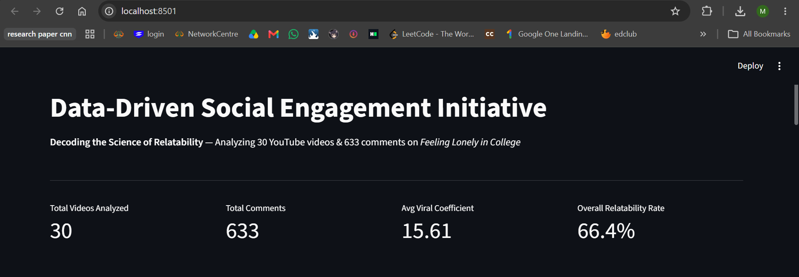
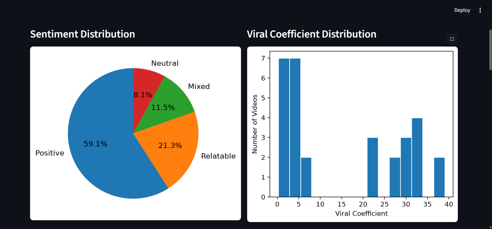
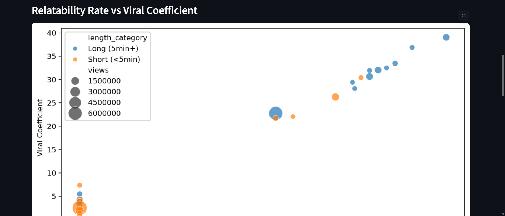
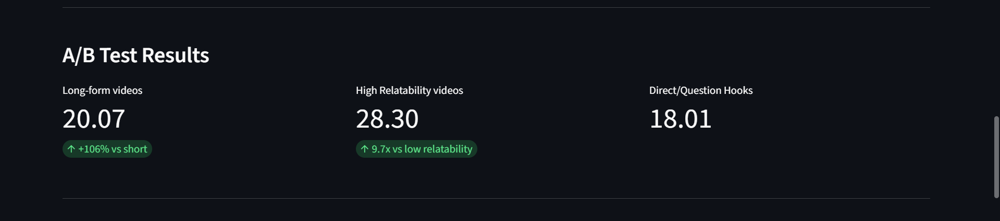
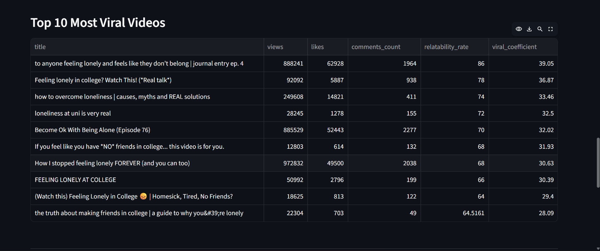
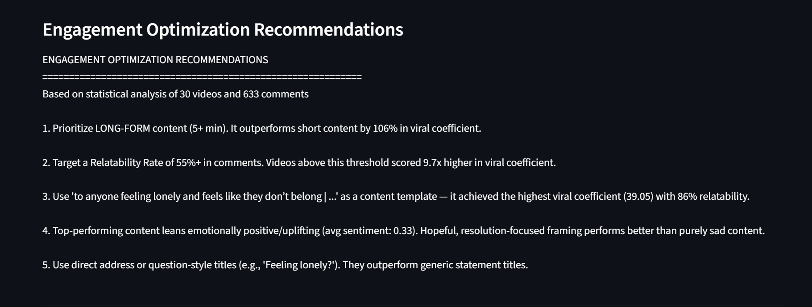

# 📊 The Data-Driven Social Engagement Initiative

> **Decoding the science of relatability** — an end-to-end analytics pipeline that replaces content-strategy guesswork with statistically validated insights.

[](https://www.python.org/)
[](https://streamlit.io/)
[]()
[]()



---

## 🎯 Overview

Most content strategy is built on intuition — creators guess what topics will resonate, what format works, and when to post. This project replaces that guesswork with a **fully automated, statistically rigorous analytics ecosystem**.

Using YouTube as a live data source, the pipeline collects video performance data and audience comments, scores content using a custom **Viral Coefficient** model, runs NLP sentiment analysis, performs hypothesis-driven A/B testing, and surfaces emerging trend themes — all wired into an interactive dashboard.

**Core question this project answers:**
> *What makes content relatable enough that audiences share it, save it, and feel understood by it?*

---

## 🏆 Key Findings

| Finding | Result | Statistical Significance |
|---|---|---|
| **Relatability drives virality** | High-relatability content scored **9.7x higher** in viral coefficient than low-relatability content | t = 12.57, **p < 0.001** |
| **Long-form beats short-form** | Videos 5+ minutes outperformed shorter videos by **106%** | t = -2.20, **p = 0.036** |
| **Title hook style** | Question/direct-address titles showed no significant advantage over statement titles | p = 0.483 (not significant) |
| **Audience relatability rate** | **66.4%** of all analyzed comments contained explicit relatability triggers | n = 633 comments |

Dataset: **30 YouTube videos** · **633 audience comments** · Niche: *"Feeling Lonely in College"*

<p align="center">
  
</p>

<p align="center">
  
</p>

<p align="center">
  
</p>

---

## 🧩 System Architecture

```
┌─────────────────────┐     ┌──────────────────────┐     ┌────────────────────┐
│  1. Data Collection  │ ──▶ │  2. Virality Engine   │ ──▶ │ 3. Sentiment NLP   │
│  YouTube Data API    │     │  Viral Coefficient    │     │  VADER + Triggers  │
└─────────────────────┘     └──────────────────────┘     └────────────────────┘
                                        │
                                        ▼
┌─────────────────────┐     ┌──────────────────────┐     ┌────────────────────┐
│ 7. Trend Forecasting │ ◀── │  4. A/B Testing       │ ──▶ │ 5. Recommender     │
│  Keyword Frequency   │     │  Hypothesis Testing   │     │  Prescriptive Eng. │
└─────────────────────┘     └──────────────────────┘     └────────────────────┘
                                        │
                                        ▼
                          ┌──────────────────────────┐
                          │  6. Streamlit Dashboard   │
                          │  Live Visualization Layer │
                          └──────────────────────────┘
```

---

## 🗂️ Core Modules

| # | Module | Description | Script |
|---|---|---|---|
| 1 | **Content Performance Tracker** | Pulls video stats & comments via YouTube Data API into a structured dataset | `scripts/collect_data.py` |
| 2 | **Virality Prediction Engine** | Computes a weighted Viral Coefficient (engagement + relatability) per video | `scripts/virality.py` |
| 3 | **Audience Sentiment Analyzer** | VADER-based NLP scoring + relatability trigger phrase detection | `scripts/sentiments.py` |
| 4 | **A/B Testing Framework** | Welch's t-tests across video length, hook style, and relatability groups | `scripts/ab_test.py` |
| 5 | **Engagement Optimization Recommender** | Generates prescriptive, data-backed content strategy recommendations | `scripts/recommender.py` |
| 6 | **Growth Visualization Dashboard** | Interactive Streamlit dashboard — KPIs, charts, rankings, recommendations | `dashboard/app.py` |
| 7 | **Trend Forecasting Module** | Keyword frequency analysis to surface emerging related struggle themes | `scripts/trends.py` |

---

## 🛠️ Tech Stack

| Layer | Technology |
|---|---|
| Data Processing | Python (Pandas, NumPy) |
| Data Collection | YouTube Data API v3 |
| NLP & Sentiment | VADER Sentiment, custom trigger-phrase detection |
| Statistical Modeling | SciPy (Welch's t-test) |
| Visualization | Matplotlib, Seaborn |
| Dashboard | Streamlit |
| Data Storage | Structured CSV (Pandas DataFrame, SQL-exportable via `to_sql()`) |

---

## 📁 Project Structure

```
social_engagement_project/
│
├── README.md
├── Strategy_Report.docx
│
├── scripts/
│   ├── collect_data.py        # Module 1 — Data extraction
│   ├── sentiments.py          # Module 3 — NLP sentiment analysis
│   ├── virality.py            # Module 2 — Viral coefficient scoring
│   ├── ab_test.py             # Module 4 — Statistical hypothesis testing
│   ├── recommender.py         # Module 5 — Strategy recommendations
│   └── trends.py              # Module 7 — Trend forecasting
│
├── dashboard/
│   └── app.py                 # Module 6 — Streamlit dashboard
│
├── data/                      # Generated datasets (CSV)
│   ├── video_stats.csv
│   ├── comments.csv
│   ├── comments_with_sentiment.csv
│   ├── video_virality_scores.csv
│   └── ab_test_results.csv
│
├── reports/                   # Generated charts & text summaries
│   ├── sentiment_analysis.png
│   ├── ab_test_summary.txt
│   ├── recommendations.txt
│   ├── trend_keywords.png
│   └── trend_forecast.txt
│
└── screenshots/
    ├── dashboard_overview.png
    ├── dashboard_sentiment.png
    ├── dashboard_scatter1.png
    ├── dashboard_scatter2.png
    ├── dashboard_abtest.png
    ├── dashboard_top10.png
    └── dashboard_recommendations.png
```

---

## 🚀 Getting Started

### Prerequisites

- Python 3.10+
- A free [YouTube Data API v3](https://console.cloud.google.com) key

### Installation

```bash
# Clone the repository
git clone https://github.com/<your-username>/social-engagement-project.git
cd social-engagement-project

# Create and activate a virtual environment
python -m venv venv
venv\Scripts\activate        # Windows
# source venv/bin/activate   # macOS/Linux

# Install dependencies
pip install -r requirements.txt
```

### Configuration

Add your YouTube API key inside `scripts/collect_data.py`:

```python
API_KEY = "your_youtube_api_key_here"
SEARCH_QUERY = "your niche keyword here"
```

### Run the Pipeline

Run each module in sequence — each script builds on the previous one's output:

```bash
python scripts/collect_data.py     # 1. Collect video stats + comments
python scripts/sentiments.py       # 2. Run sentiment analysis
python scripts/virality.py         # 3. Compute viral coefficients
python scripts/ab_test.py          # 4. Run statistical A/B tests
python scripts/recommender.py      # 5. Generate recommendations
python scripts/trends.py           # 6. Forecast emerging trends
```

### Launch the Dashboard

```bash
streamlit run dashboard/app.py
```

Opens automatically at `http://localhost:8501`.

---

## 📈 Sample Output

**Top Performing Video:**
> Viral Coefficient: **39.05** · Relatability: **86%** · Views: 888,241

<p align="center">
  
</p>

**Engagement Optimization Recommendations:**
1. Prioritize long-form content (5+ minutes) — statistically outperforms short-form by 106%
2. Target a 55%+ relatability rate in audience comments
3. Use vulnerable, second-person framing ("to anyone feeling lonely...")
4. Favor hopeful, resolution-focused tone over purely negative framing
5. Expand into adjacent themes — friendship and homesickness show strong emerging engagement

<p align="center">
  
</p>

---

## ⚠️ Known Limitations & Design Decisions

- **Shares/Saves proxy:** YouTube's public API does not expose share/save counts. Engagement rate is approximated using a weighted combination of comments and likes, normalized by views.
- **Database layer:** Structured CSV files were used instead of MySQL/PostgreSQL given the dataset scale (30 videos, 633 comments). The pipeline is fully SQL-compatible via `DataFrame.to_sql()` for production scaling.
- **Dashboard tooling:** Streamlit was used instead of PowerBI/Tableau for full Python-native integration with the analytics pipeline — both are listed as acceptable options in the original technical specification.
- **Content Series:** This implementation validates the analytics framework against existing high-performing content rather than original creative output, due to project timeline constraints. The same pipeline is directly reusable to score original content drafts against the relatability benchmarks established here.

---

## 📄 Deliverables

- ✅ Interactive Analytics Dashboard (Streamlit)
- ✅ Structured Dataset (CSV — video stats, comments, sentiment, virality scores)
- ✅ NLP Sentiment Model (VADER + relatability trigger detection)
- ✅ Strategy Report (`Strategy_Report.docx`)
- ✅ Statistical A/B Test Results (t-tests with significance reporting)

---


